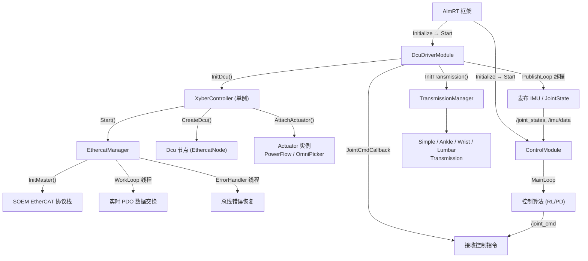
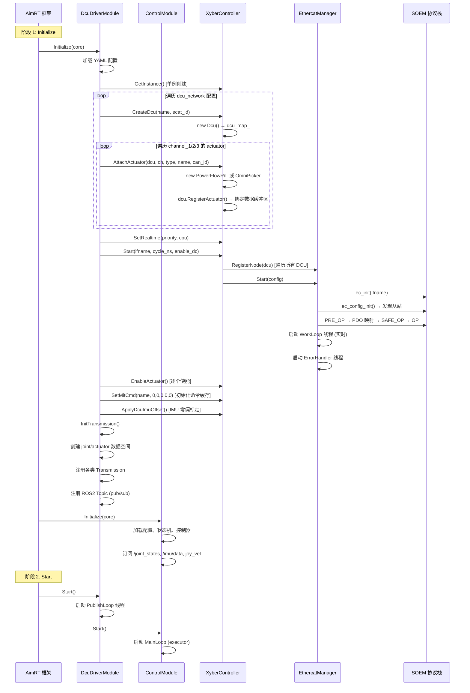
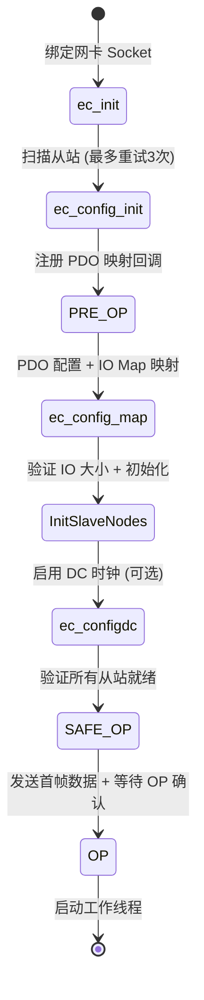
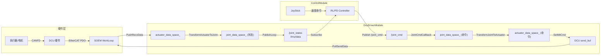

# 控制链路初始化过程深度分析

基于 `src/module/dcu_driver_module` 及相关模块的源码，对整个控制链路的初始化过程进行层次化分析。

---

## 系统架构总览



---

## 初始化时序（按调用顺序）



---

## 逐层详细分析

### 第 1 层：AimRT 框架入口

AimRT 作为模块化框架，对每个 Module 按 **Initialize → Start → (运行) → Shutdown** 的生命周期管理。

- `DcuDriverModule` 继承 `aimrt::ModuleBase`
- 框架通过配置文件（YAML）指定模块列表和各模块的配置文件路径

### 第 2 层：DcuDriverModule::Initialize

> [dcu_driver_module.cc:17-63](file:///home/jori/Project/zhiyuan-x1-infer/src/module/dcu_driver_module/src/dcu_driver_module.cc#L17-L63)

初始化分为 **4 个子阶段**：

#### 2.1 加载配置参数

```
imu_dcu_name_       ← 指定 IMU 所在的 DCU 名称
actuator_debug_     ← 是否发布 actuator 调试数据
enable_actuator_    ← 是否使能执行器
publish_frequecy_   ← 状态发布频率
joint_name_list_    ← 关节名列表（固定顺序，供 RL 控制器使用）
actuator_name_list_ ← 执行器名列表
```

#### 2.2 InitDcu — 硬件层初始化

> [dcu_driver_module.cc:82-142](file:///home/jori/Project/zhiyuan-x1-infer/src/module/dcu_driver_module/src/dcu_driver_module.cc#L82-L142)

按顺序完成以下步骤：

| 步骤 | 代码 | 说明 |
|-----|------|-----|
| 1 | 解析 `ethercat` 和 `dcu_network` 配置 | 获取网卡名、DC使能、周期时间等 |
| 2 | `XyberController::GetInstance()` | 创建全局单例控制器 |
| 3 | 遍历 DCU 配置，调用 `CreateDcu()` | 为每个 DCU 创建实例并注册 |
| 4 | 遍历每个 DCU 的 3 个通道，调用 `AttachActuator()` | 创建执行器并绑定到 DCU 的 CANFD 数据区 |
| 5 | `SetRealtime(rt_priority, bind_cpu)` | 设置实时线程参数 |
| 6 | `Start(ifname, cycle_ns, enable_dc)` | **启动 EtherCAT 通信** |
| 7 | `EnableActuator()` 逐个使能 | 按 `actuator_name_list_` 顺序串行使能，详见 [使能流程详解](#522-enableactuator-详解) |
| 8 | `SetMitCmd(name, 0,0,0,0,0)` | 将所有执行器的命令缓存归零 |
| 9 | `ApplyDcuImuOffset()` | 对使能了 IMU 的 DCU 执行零偏标定 |

#### 2.3 InitTransmission — 传动层初始化

> [dcu_driver_module.cc:144-355](file:///home/jori/Project/zhiyuan-x1-infer/src/module/dcu_driver_module/src/dcu_driver_module.cc#L144-L355)

传动层负责 **关节空间 ↔ 执行器空间** 的坐标变换。

- 创建 `joint_data_space_` 和 `actuator_data_space_` — 双数据空间
- 从配置中解析 `transmission`, 支持 **5 种传动类型**:

| 传动类型 | 说明 | 执行器/关节 |
|---------|------|------------|
| `SimpleTransmission` | 1:1 线性映射，乘以 direction 系数 | 1 actuator ↔ 1 joint |
| `LeftAnkleParallelTransmission` | 左踝并联机构 | 2 actuators ↔ 2 joints (pitch+roll) |
| `RightAnkleParallelTransmission` | 右踝并联机构 | 同上 |
| `Left/RightWristParallelTransmission` | 手腕并联机构 | 2 actuators ↔ 2 joints (pitch+roll) |
| `LumbarParallelTransmission` | 腰部并联机构 | 2 actuators ↔ 2 joints (pitch+roll) |

#### 2.4 通信管道注册

注册 4 个 publisher 和 1 个 subscriber：

| Topic | 方向 | 消息类型 | 用途 |
|-------|------|---------|------|
| `/imu/data` | 发布 | `sensor_msgs/Imu` | IMU 数据 |
| `/joint_states` | 发布 | `sensor_msgs/JointState` | 关节状态 |
| `/actuator_cmd` | 发布 | `JointCommand` | 调试用：执行器命令 |
| `/actuator_states` | 发布 | `sensor_msgs/JointState` | 调试用：执行器状态 |
| `/joint_cmd` | 订阅 | `JointCommand` | **接收控制指令** |

### 第 3 层：XyberController — 中间控制层

> [xyber_controller.cpp](file:///home/jori/Project/zhiyuan-x1-infer/src/module/dcu_driver_module/xyber_controller/xyber_api/src/xyber_controller.cpp)

**单例模式**，管理所有 DCU 实例和执行器映射关系。

关键数据结构：

```
static EthercatConfig ecat_config_;                          // EtherCAT 配置
static EthercatManager ecat_manager_;                        // EtherCAT 主站管理器
static std::unordered_map<string, Dcu*> dcu_map_;            // DCU 名称 → DCU 实例
static std::unordered_map<string, Dcu*> actuator_dcu_map_;   // 执行器名称 → 所属 DCU
```

`Start()` 流程：
1. 将所有 DCU 注册到 `EthercatManager`
2. 设置 EtherCAT 配置
3. 调用 `ecat_manager_.Start()` 启动通信

### 第 4 层：EthercatManager — EtherCAT 主站

> [ethercat_manager.cpp](file:///home/jori/Project/zhiyuan-x1-infer/src/module/dcu_driver_module/xyber_controller/xyber_api/src/ethercat_manager.cpp)

#### 4.1 InitMaster 状态机转换



#### 4.2 WorkLoop — 实时 IO 循环

> [ethercat_manager.cpp:314-363](file:///home/jori/Project/zhiyuan-x1-infer/src/module/dcu_driver_module/xyber_controller/xyber_api/src/ethercat_manager.cpp#L314-L363)

- 设置 RT 优先级和 CPU 绑定
- 循环周期 = `cycle_time_ns`（通常 1ms）
- 每个周期：`ec_receive_processdata` → 分发到各 DCU → 各 DCU 回填 → `ec_send_processdata`
- DC 模式下使用 PI 控制器同步主站时钟与从站 DC 时钟

#### 4.3 ErrorHandler — 总线错误恢复

- 每 100ms 检查一次 WKC
- 自动恢复 SAFE_OP+ERROR、重新配置丢失的从站
- 连续 10 次 WKC 错误判定为链路断开

### 第 5 层：DCU — EtherCAT 从站节点

> [dcu.cpp](file:///home/jori/Project/zhiyuan-x1-infer/src/module/dcu_driver_module/xyber_controller/xyber_api/src/dcu.cpp)

实现 `EthercatNode` 接口，管理 3 个 CANFD 通道和 IMU 数据。

**PDO 数据结构**：

| 发送帧 (`DcuSendPacket`, 240B) | 接收帧 (`DcuRecvPacket`, 240B) |
|---|----|
| canfd[0~2]: ctrl(1B) + data(64B) × 3 | canfd[0~2]: data(64B) × 3 |
| imu_cmd (1B) | imu: acc(12B) + gyro(12B) + quat(16B) |
| reserved (44B) | reserved (8B) |

#### 5.1 CANFD 通道 ctrl 寻址机制

> [dcu.cpp:74-76](file:///home/jori/Project/zhiyuan-x1-infer/src/module/dcu_driver_module/xyber_controller/xyber_api/src/dcu.cpp#L74-L76)

`ctrl` 字段（`uint8_t`）采用**位掩码（bitmask）**编码来寻址目标执行器：

```cpp
void Dcu::SetChannelId(CtrlChannel ch, uint8_t id) {
  send_buf_.canfd[(int)ch].ctrl = id == CHANNEL_BROADCAST_ID ? id : 1 << (id - 1);
}
```

| `can_id` | `1 << (id-1)` | 二进制 | 十六进制 | 说明 |
|----------|---------------|--------|---------|------|
| 1 | `1 << 0` | `0000 0001` | `0x01` | |
| 2 | `1 << 1` | `0000 0010` | `0x02` | |
| 3 | `1 << 2` | `0000 0100` | `0x04` | |
| 4 | `1 << 3` | `0000 1000` | `0x08` | |
| 5 | `1 << 4` | `0001 0000` | `0x10` | 不与任何特殊值冲突 |
| 6 | `1 << 5` | `0010 0000` | `0x20` | |
| 7 | `1 << 6` | `0100 0000` | `0x40` | |
| 8 | `1 << 7` | `1000 0000` | `0x80` | |
| 0xFF | broadcast | `1111 1111` | `0xFF` | 广播所有设备 |

> [!NOTE]
> `SetChannelId` 是**赋值操作**（`=`），不是位或（`|=`），每次调用完整覆盖 `ctrl` 字段。
> 这不会造成问题，因为：
> - **使能时**：串行逐个执行，写入 → 等待回应 → 下一个 |
> - **运行时** `SetMitCmd`：使用 `CHANNEL_BROADCAST_ID`（`0xFF`），不走位掩码分支

#### 5.2 执行器使能流程

##### 5.2.1 遍历顺序

> [dcu_driver_module.cc:119-134](file:///home/jori/Project/zhiyuan-x1-infer/src/module/dcu_driver_module/src/dcu_driver_module.cc#L119-L134)

```cpp
for (const auto name : actuator_name_list_) {   // ← 按 actuator_name_list_ 顺序
    if (!xyber_ctrl_->EnableActuator(name)) { ret = false; }
}
```

遍历顺序 = YAML `actuator_list` 的声明顺序（**不是** `can_id` 顺序，也不按 DCU 分组），是跨 DCU、跨通道的扁平列表：

```
left_hip_pitch → left_hip_roll → ... → left_ankle_right    (hip DCU ch1)
→ right_hip_pitch → ... → right_ankle_right                (hip DCU ch2)
→ lumbar_left → lumbar_right → lumbar_yaw                  (body ch3 + hip ch3)
→ left_shoulder_pitch → ... → left_claw                    (body DCU ch1)
→ right_shoulder_pitch → ... → right_claw                  (body DCU ch2)
```

> [!IMPORTANT]
> 使能失败**不中断**循环 — 仅标记 `ret = false`，继续尝试后续执行器。全部遍历后统一检查并抛异常。

##### 5.2.2 EnableActuator 详解

> [dcu.cpp:111-139](file:///home/jori/Project/zhiyuan-x1-infer/src/module/dcu_driver_module/xyber_controller/xyber_api/src/dcu.cpp#L111-L139)

完整流程：

1. `POWER_FLOW_L28` / `OMNI_PICKER` 类型直接 `return true`（无需使能）
2. 加锁写入 `actr->RequestState(STATE_ENABLE)` + `SetChannelId(ch, id)`
3. WorkLoop 线程自动将 send_buf 发往 DCU 硬件
4. 轮询等待反馈：每 **10ms** 检查一次 `actr->GetPowerState()`，最多 **100 轮 = 1 秒**超时
5. 成功返回 `true`，超时返回 `false`

| 条件 | 行为 |
|------|------|
| `POWER_FLOW_L28` / `OMNI_PICKER` | 跳过，直接 `return true` |
| 1 秒内收到 `STATE_ENABLE` | 提前 break，`return true` |
| 1 秒内未收到使能确认 | 打印 ERROR，`return false` |

##### 5.2.3 最坏耗时估算

实际配置中 31 个执行器，去除 4 个 `POWER_FLOW_L28` + 4 个 `OMNI_PICKER` = **23 个需要使能**（R86/R52 类型）。
- 正常情况：每个执行器约 10~50ms 完成使能，总计 ~1s
- 最坏情况（全部超时）：23 × 1s = **~23 秒**

### 第 6 层：ControlModule — 上层控制

> [control_module.cc](file:///home/jori/Project/zhiyuan-x1-infer/src/module/control_module/src/control_module.cc)

初始化流程：
1. 解析 **状态机** 配置 (`robot_states`)，订阅触发 topic
2. 实例化 **控制器** (`rl_` 前缀 → RLController, `pd_` 前缀 → PDController)
3. 订阅传感器数据：`/joint_states`、`/imu/data`、摇杆速度
4. 注册关节命令发布器 → `/joint_cmd`

运行时 MainLoop 循环：
- 按 `control_frequecy` 频率（如 50Hz）执行
- 根据当前状态机 state 获取活跃控制器
- 调用 `controller->Update()` 计算控制输出
- 发布 `JointCommand` → DcuDriverModule 接收

---

## 数据流闭环



---

## 关键设计要点

### 1. 线程模型

| 线程 | 所属 | 实时 | 频率 | 职责 |
|------|-----|------|-----|------|
| `ecat_io_loop` | EthercatManager | ✅ RT | 1kHz | EtherCAT 数据收发 |
| `ecat_er_loop` | EthercatManager | ❌ | 10Hz | 总线错误检测与恢复 |
| `publish_thread` | DcuDriverModule | ❌ | 可配 | 传感器数据发布 |
| `rl_control_pub_thread` | ControlModule | ❌ | 可配 | 控制算法执行+命令发布 |

### 2. 并发保护

- **EthercatNode 层**: `send_mtx_` / `recv_mtx_` 保护 PDO 缓冲区的读写
- **DcuDriverModule 层**: `rw_mtx_` 保护 Transmission 变换的原子性
- **DCU 层**: 独立的 `send_mtx_` / `recv_mtx_` 保护命令写入和状态读取

### 3. 初始化依赖链

> [!IMPORTANT]
> 初始化顺序 **不可调换**，每一步都依赖前一步完成：

```
加载配置 → 创建 DCU → 挂载执行器 → 设置实时性 → 启动 EtherCAT
→ 使能执行器 → 初始化命令缓存 → IMU 校准 → 初始化传动层 → 注册通信管道
```

如果执行器使能在 EtherCAT `Start()` 之前调用，将因为没有通信通道而失败。
如果传动层在 DCU 初始化之前创建，将无法获取有效的执行器数据空间。

### 4. CANFD ctrl 寻址安全性

`ctrl` 字段使用 `1 << (id - 1)` 位掩码编码，`can_id` 范围 1~8 正好映射到 `uint8_t` 的 bit0~bit7，**无冲突、无溢出**。

运行时 `SetMitCmd` 一律使用广播 `0xFF`，64 字节 `data` 中每个执行器占 `ACTUATOR_FRAME_SIZE`（8B）的固定 slot，通过 `send_buf + 8 * (id - 1)` 定位，不受 `ctrl` 字段影响。因此 `ctrl` 的覆盖语义在运行时不构成风险。
