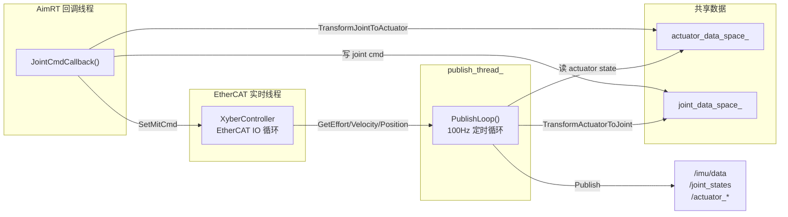

# DCU Publish Thread 线程模型分析

## 概览

`DcuDriverModule` 采用**双线程 + 共享内存**的并发模型，通过一个独立的 `publish_thread_` 周期性地从硬件读取传感器数据并发布 ROS2 消息，同时在 AimRT 框架的回调线程中接收关节指令并下发到执行器。



## 线程清单

| 线程 | 创建方式 | 调度策略 | 核心职责 |
|---|---|---|---|
| **publish_thread_** | `std::thread` (L67) | 普通 `SCHED_OTHER`，无实时优先级 | 周期性读取传感器、发布消息 |
| **EtherCAT IO 线程** | `XyberController::Start()` 内部创建 | 可配 RT 优先级 + CPU 绑核 (`SetRealtime`) | EtherCAT 帧收发，驱动执行器通信 |
| **AimRT 回调线程** | 框架管理 | 框架决定 | 执行 `JointCmdCallback` |

## publish_thread_ 生命周期

```
Initialize()                      Start()                         Shutdown()
    │                                │                                │
    ▼                                ▼                                ▼
 配置加载、DCU/SDK 初始化     is_running_ = true           is_running_ = false
 注册 Publisher/Subscriber     创建 std::thread              publish_thread_.join()
                              ──▶ PublishLoop()               DisableAllActuator()
                                                              Stop()
```

关键点：
- `Start()` 中通过 `std::thread(&DcuDriverModule::PublishLoop, this)` 创建线程
- `Shutdown()` 先设 `is_running_ = false`（`std::atomic_bool`），再 `join()` 等待线程退出

## PublishLoop 内部逻辑（单次迭代）

```
┌─── 每周期（1/publish_frequency_ 秒，默认 10ms / 100Hz）───┐
│                                                           │
│  1. gettimeofday → 获取时间戳                              │
│                                                           │
│  2. 刷新 actuator_data_space_.state                       │
│     └─ 调用 xyber_ctrl_->GetEffort/Velocity/Position()    │
│        （从 EtherCAT IO 线程的缓存中读取）                   │
│                                                           │
│  3. 🔒 lock(rw_mtx_)                                     │
│     └─ transmission_.TransformActuatorToJoint()           │
│        （actuator state → joint state 坐标变换）            │
│     🔓 unlock                                             │
│                                                           │
│  4. 组装 JointState 消息 → Publish /joint_states           │
│                                                           │
│  5. [可选] actuator_debug_ 模式：                          │
│     └─ Publish /actuator_cmd 和 /actuator_states          │
│                                                           │
│  6. 读取 IMU 数据 → Publish /imu/data                     │
│                                                           │
│  7. next_loop_time += period                              │
│     sleep_until(next_loop_time)                           │
│                                                           │
└───────────────────────────────────────────────────────────┘
```

## 并发同步分析

### 临界区：`rw_mtx_`

`rw_mtx_` 是唯一的互斥锁，保护 `transmission_` 的坐标变换操作：

| 线程 | 操作 | 锁定范围 |
|---|---|---|
| **publish_thread_** | `TransformActuatorToJoint()` | 读 `actuator_data_space_.state` → 写 `joint_data_space_.state` |
| **AimRT 回调线程** | `TransformJointToActuator()` | 读 `joint_data_space_.cmd` → 写 `actuator_data_space_.cmd` |

两者操作的**字段不同**（`.state` vs `.cmd`），但 `Transmission` 对象通过指针直接操作 `DataSpace`，锁保护确保变换过程的原子性。

### 无锁访问区（潜在风险点）

> [!WARNING]
> 以下操作**未使用 `rw_mtx_` 保护**，存在潜在数据竞争：

1. **`actuator_data_space_.state` 的写入**（publish_thread_ L402-406）与 `TransformActuatorToJoint` 的读取虽在同一线程内，但与 EtherCAT IO 线程的写入之间无显式同步（依赖 `XyberController` 内部实现）。

2. **`JointCmdCallback` 写入 `joint_data_space_.cmd`**（L482-486）在锁外进行，与 publish_thread_ 读取 `joint_data_space_.state` 操作不同字段，但共享同一 `DataSpace` 结构。

### 定时模型

```
时间轴 ──────────────────────────────────────────────▶

publish_thread_:  |──work──|sleep|──work──|sleep|──work──|
                  T0      T0+Δ  T1      T1+Δ  T2

period = 1/publish_frequency_ (默认 10ms)
采用 sleep_until 绝对时间定时，能补偿处理耗时的抖动
```

## 数据流总结

```
                  ┌──────────────────────────────────────┐
  /joint_cmd ──▶  │  JointCmdCallback (AimRT 回调线程)     │
                  │   ├─ 写 joint_data_space_.cmd         │
                  │   ├─ 🔒 TransformJointToActuator      │
                  │   └─ SetMitCmd → EtherCAT             │
                  └──────────────────────────────────────┘
                              ▲ rw_mtx_ ▼
                  ┌──────────────────────────────────────┐
  /joint_states ◀─│  PublishLoop (publish_thread_)        │
  /imu/data     ◀─│   ├─ Get* ← EtherCAT 缓存            │
                  │   ├─ 写 actuator_data_space_.state    │
                  │   ├─ 🔒 TransformActuatorToJoint      │
                  │   └─ Publish                          │
                  └──────────────────────────────────────┘
```

## 设计特点

1. **非实时发布线程**：`publish_thread_` 未设实时调度策略，与 EtherCAT IO 线程的 RT 优先级形成隔离——发布延迟不影响底层通信。
2. **最小粒度锁**：`rw_mtx_` 仅锁定变换计算，不覆盖 IO 和发布操作，减少锁争用。
3. **绝对时间定时**：`sleep_until` 避免累积漂移，保证发布频率稳定。
4. **单向数据流**：state 数据从硬件流向发布，cmd 数据从订阅流向硬件，天然减少竞争。
